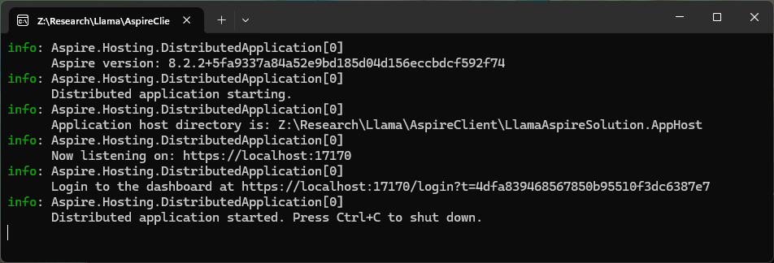
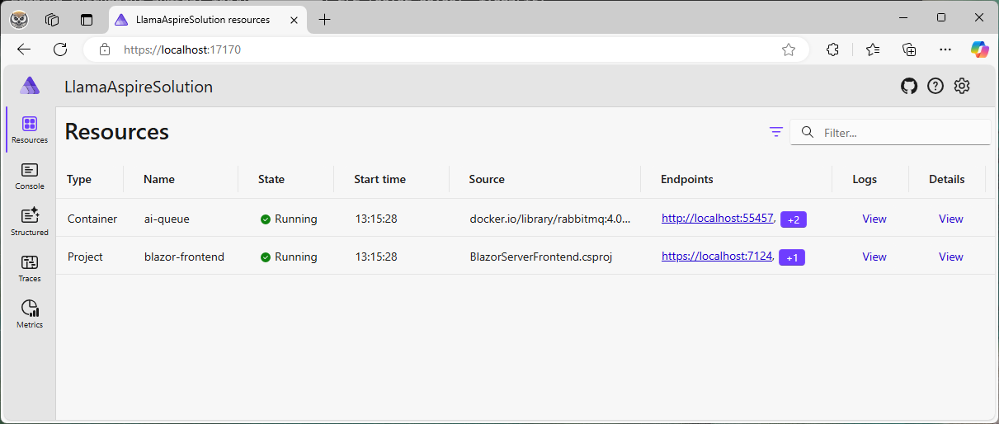
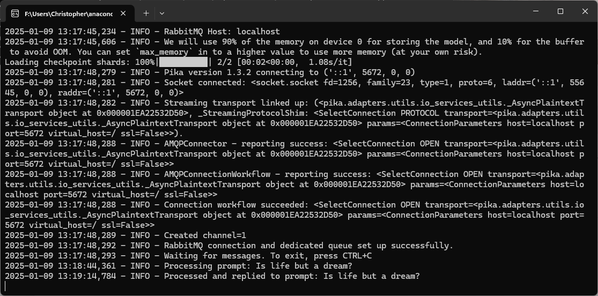
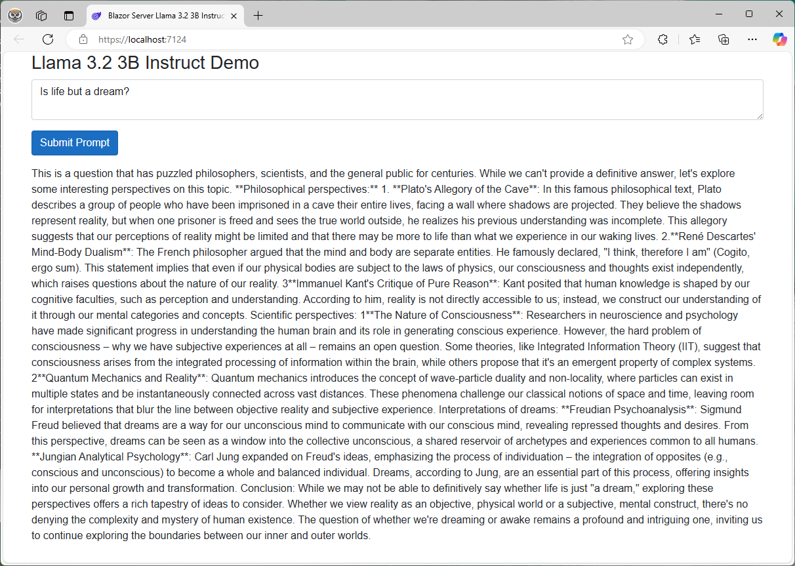

# Llama 3.2 3B Instruct Integration with C#

This project demonstrates how to integrate **Meta's Llama 3.2 3B Instruct** model into a C# application using a Python gRPC server as the backend. The goal is to leverage AI to generate as much of the solution code as possible, showcasing the capabilities of large language models in real-world applications.

## Table of Contents
1. [Overview](#overview)
2. [Prerequisites](#prerequisites)
3. [How to Run the Software System](#how-to-run-the-software-system)
4. [Contributing](#contributing)
5. [License](#license)
6. [Acknowledgments](#acknowledgments)

---

## Overview

The project consists of two main components:
1. **Python Server Backend**:
   - A RabbitMQ server that hosts the **Llama 3.2 3B Instruct** model.
   - The server receives text prompts from the C# client, generates responses using the model, and returns the results.

2. **C# Console Frontend**:
   - A console application that interacts with the Python RabbitMQ server.
   - Users can input prompts, and the application displays the AI-generated responses.

The objective is to use AI to write as much of the solution code as possible, demonstrating the power of large language models in automating development tasks.

---

## Prerequisites

### Python Server Backend
- Anaconda Distribution for Microsoft Windows
- Python 3.12 (see `environment.yml`)
- GPU with CUDA support (recommended for faster inference)
- Hugging Face account with Meta Llama 3.2 3B Instruct access approval
- Hugging Face `transformers` library
- RabbitMQ via the `pica` library

### C# Console Frontend
- Microsoft Aspire / Blazor Server
- .NET 8 SDK
- RabbitMQ and `RabbitMQ.Client` libraries

---

## How to Run the Software System

Follow these steps to set up and run the software system:

1. **Ensure Docker Desktop for Windows** is installed and running.
2. **Open the solution file** (`DotNetToPython.sln`) in **Visual Studio 2022 (64-bit) v17.12.3** or higher.
3. **Set `LlamaAspireSolution.AppHost`** as the Startup Project.
4. **Run the solution** in Visual Studio.
5. After the AppHost successfully launches in your web browser, click on the first endpoint hyperlink for the **`blazor-frontend`** project.
6. **Open another instance of Visual Studio** and ensure that `prompt_processor.py` is set as the Startup file within the **LlamaServer** Python project.
7. **Run the Python solution** in Visual Studio and wait for the logging message:  
   `"Waiting for messages. To exit, press CTRL+C"` to appear in the Python console.
8. **Type a prompt** into the Blazor frontend webpage (e.g., “Is life but a dream?”) and click the **“Submit Prompt”** button.
9. **Wait patiently** for the Llama 3.2 3B Instruct model to process the prompt and for the Blazor frontend to display the response.

**Note:** This project is strictly intended for research purposes and is not suitable for production use.

---

## Contributing

Contributions are welcome! If you'd like to improve the project, please follow these steps:
1. Fork the repository.
2. Create a new branch for your feature or bugfix.
3. Submit a pull request with a detailed description of your changes.

---

## License

This project is licensed under the MIT License. See the [LICENSE.txt](LICENSE.txt) file for details.

---

## Acknowledgments

- **Meta AI** for developing the Llama 3.2 3B Instruct model.
- **Hugging Face** for providing the `transformers` library.
- **gRPC** for enabling seamless communication between the Python server and C# client.
- **RabbitMQ** for facilitating message queuing between the Python server and C# client.

---

## Screenshots

Here are some screenshots of the project in action:

  
*Aspire Client Startup*

  
*Aspire Client Orchestrator*

  
*Python Backend Server*

  
*Aspire Blazor Server Client Frontend*

---
